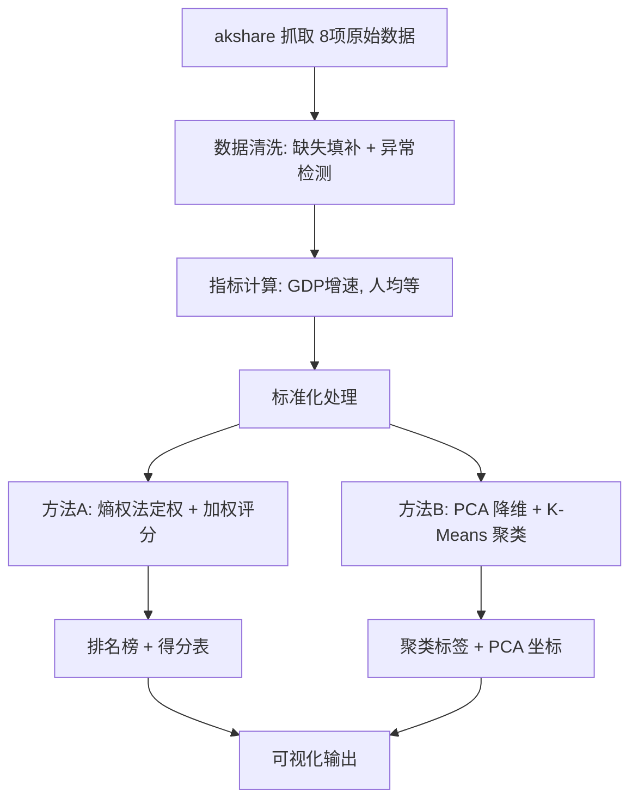

# 中国省域经济综合竞争力评价 v2

## 项目定位

基于国家统计局公开数据，构建多维指标体系，采用**双方法并行**设计——熵权法定量评分 + PCA/K-Means 结构分类——对中国 31 个省/自治区/直辖市的经济竞争力进行量化排名与聚类分析。

**适用课程**: Python 经济大数据分析 | **组队**: 4 人 | **工期**: 2 周编码 + 1 周报告/PPT

---

## 一、指标体系（8 指标 × 31 省）

### 1.1 设计原则

- 指标含义直观，不需要深厚经济学背景
- 数据均可通过 akshare 从国家统计局获取或简单计算得到
- 每个指标的可获取性已经过验证（见下表）

### 1.2 指标体系

```
维度1: 经济实力 (3指标)
├── A1  地区生产总值 (亿元)               [正向]  直接可拿, 季度/年度
├── A2  GDP 增速 (%)                      [正向]  GDP 跨年计算
└── A3  社会消费品零售总额 (亿元)          [正向]  高概率可拿, 年度

维度2: 居民生活 (3指标)
├── B1  居民人均可支配收入 (元)            [正向]  直接可拿, 季度
├── B2  居民消费价格指数 (上年=100)       [适度]  直接可拿, 月度分省
└── B3  城镇登记失业率 (%)                [负向]  可拿, 月度

维度3: 投资与财政 (2指标)
├── C1  固定资产投资完成额 (亿元)          [正向]  高概率可拿, 年度/月度
└── C2  地方一般公共预算收入 (亿元)        [正向]  文档提及
```

### 1.3 数据可获取性验证

| 指标       | akshare path                                   | kind             | 验证状态             |
| ---------- | ---------------------------------------------- | ---------------- | -------------------- |
| 地区生产总值   | `国民经济核算 > 地区生产总值`                    | 分省季度/年度     | ✅ 源码+文档确认      |
| 居民人均可支配收入 | `人民生活 > 居民人均可支配收入`                  | 分省季度数据       | ✅ 源码+文档确认      |
| 居民消费价格指数 | `价格指数 > 居民消费价格指数`                    | 分省月度数据       | ✅ cnstats 确认有分省 |
| 消费品零售总额  | `国内贸易 > 社会消费品零售总额`                  | 分省年度数据       | ⚠️ NBS 分省库有此分类 |
| 固定资产投资   | `固定资产投资 > 固定资产投资额`                  | 分省年度数据       | ⚠️ NBS 分省库有此分类 |
| 地方财政收入   | `财政 > 地方一般公共预算收入`                    | 分省年度数据       | ⚠️ 文档提及          |
| 城镇登记失业率  | `就业人员和工资 > 城镇登记失业率`                | 分省月度数据       | ⚠️ 待运行时验证      |
| GDP 增速      | — (跨年计算)                                   | —                 | ✅ 无依赖            |

> **风险控制**: 每个 $\scriptsize⚠️$ 项在开发第一天用 `try/except` 跑一遍，拿不到则从备选池替换。
>
> **备选指标池**: 人均 GDP（计算）、工业增加值增速、房地产开发投资额、居民人均消费支出、进出口总额。

### 1.4 数据覆盖

- **省份**: 中国大陆 31 省/自治区/直辖市
- **年份**: 默认分析最近 2~3 年（支持多年度趋势对比）
- **缺失处理**: 均值填补 + 相邻年份线性插值

---

## 二、技术路线：双方法并行

### 2.1 核心思路

熵权评分和 PCA/K-Means 针对归一化后的同一份数据，**分别独立运行**，回答不同问题：

```
                          ┌──→ [方法A] 熵权法 + 加权评分
                          │       输出: 31省排名 + 得分 (0-100)
                          │       回答: "谁发展水平更高？"
归一化指标数据 (31省×8指标) ──┤
                          │
                          └──→ [方法B] PCA降维 + K-Means 聚类
                                  输出: 4个聚类标签 + PCA坐标
                                  回答: "哪些省发展模式相近？"
```

### 2.2 技术细节

| 步骤           | 方法A: 熵权评分                          | 方法B: PCA + K-Means                 |
| -------------- | --------------------------------------- | ------------------------------------ |
| 标准化         | Min-Max 归一化 (正向指标) + 反向处理     | Z-Score 标准化                       |
| 核心计算       | 信息熵 → 差异化系数 → 客观权重 → 加权总分 | PCA 提取前 2 主成分 → K-Means (k=4)  |
| 输出           | score (0~100), rank (1~31)              | cluster_label (0~3), pca_x, pca_y    |
| 验证指标       | 权重分布检查（无单一指标主导）            | Silhouette 系数 + 肘部法则图         |

### 2.3 为什么选这两种方法

| 方面         | 论证                                                                   |
| ------------ | ---------------------------------------------------------------------- |
| **课程契合** | 熵权法体现"让数据说话"，PCA/K-Means 是经典大数据降维+聚类组合          |
| **数学难度** | 二学生可理解：熵权法 = 根据数据分散程度自动定权重；PCA = 把 8 维压到 2 维 |
| **报告深度** | 两种方法正交互补，可以写出"上海分数高但跟浙江同簇"这类交叉发现         |
| **代码量**   | 两种方法核心各 30 行，scikit-learn 一行调用，不会超时                   |

### 2.4 技术路线图



---

## 三、main.py 接口契约（每人一个公开函数）

### 3.1 接口总览

```
main(year)
  │
  ├─(1)──→ 同学②. get_indicators(year)  ──→ 原始指标 DataFrame
  │
  ├─(2)──→ 同学①. analyze(raw_df)       ──→ {"scores", "clusters", "weights", "pca_xy"}
  │
  └─(3)──→ 同学③. visualize(result)     ──→ 写 4 张图到 output/
```

### 3.2 接口详细定义

```python
# ═══════════════════════════════════════════════════════════
# 同学② — 数据工程 (ML 同学)
# ═══════════════════════════════════════════════════════════
def get_indicators(year: int = 2023) -> pd.DataFrame:
    """
    从 akshare 获取 31 省 × 8 指标的原始数据。

    Input:
        year (int): 目标年份, 如 2023

    Output:
        pd.DataFrame, shape (31, 8):
            index  = ["北京市", "天津市", ..., "新疆维吾尔自治区"]
            columns = ["gdp", "gdp_growth", "retail",
                       "income", "cpi", "unemployment",
                       "fixed_invest", "fiscal_revenue"]
            所有值为原始量纲 (亿元, 元, %, 等)
            缺失值已填补, 异常值已标记
    """

# ═══════════════════════════════════════════════════════════
# 同学① — 模型算法 (ML 同学)
# ═══════════════════════════════════════════════════════════
def analyze(raw_df: pd.DataFrame) -> dict:
    """
    接收原始指标 DataFrame, 内部分别运行方法A和方法B。

    Input:
        raw_df: get_indicators() 的返回值

    Output:
        dict 包含以下字段:
        {
            "scores":    pd.DataFrame,  columns=["province","score","rank"]
            "clusters":  pd.DataFrame,  columns=["province","label"]
            "weights":   dict,          {"gdp": 0.15, "income": 0.18, ...}
            "pca_xy":    np.ndarray,    shape (31, 2), PCA前2主成分坐标
        }
    """

# ═══════════════════════════════════════════════════════════
# 同学③ — 可视化 (入门同学)
# ═══════════════════════════════════════════════════════════
def visualize(result: dict) -> None:
    """
    接收 analyze() 的输出, 生成图表并保存到 output/。

    Input:
        result: analyze() 的返回值

    Output (写入文件):
        output/map.html       — 中国地图热力图 (按得分着色)
        output/ranking.png    — 31 省排名柱状图
        output/radar.png      — 按聚类分组雷达图
        output/clusters.png   — PCA 散点图 (按聚类着色, 含省份标签)
    """

# ═══════════════════════════════════════════════════════════
# 同学④ — 主编排 (入门同学)
# ═══════════════════════════════════════════════════════════
def main(year: int = 2023):
    """串联三步: 数据 → 分析 → 可视化, 打印关键结论。"""
    print(f"Fetching indicators for {year}...")
    df = get_indicators(year)

    print(f"Analyzing {df.shape[0]} provinces...")
    result = analyze(df)

    print(f"Generating charts...")
    visualize(result)

    # 打印 TOP10 (方便报告引用)
    top10 = result["scores"].sort_values("score", ascending=False).head(10)
    print("\nTop 10 Provinces:")
    print(top10.to_string(index=False))

    # 打印聚类分布
    print(f"\nCluster distribution:\n{result['clusters']['label'].value_counts().sort_index()}")

if __name__ == "__main__":
    main()
```

### 3.3 数据流图

```
get_indicators(2023) → DataFrame(31, 8)
      │
      ▼
analyze(raw_df) → {
    scores:   DataFrame(31, 3)   ← 方法A
    clusters: DataFrame(31, 2)   ← 方法B
    weights:  dict(8)            ← 方法A
    pca_xy:   ndarray(31, 2)     ← 方法B
}
      │
      ▼
visualize(result) → 写文件到 output/
```

---

## 四、项目目录结构

```
province_economy/
├── src/
│   ├── __init__.py
│   ├── config.py             # 指标名常量、akshare path、省份列表
│   │
│   ├── data/                  # Layer 0 — 数据层 (同学②)
│   │   ├── __init__.py
│   │   ├── fetcher.py         # 8个指标逐一 fetch, 含 try/except fallback
│   │   └── cleaner.py         # 缺失值填补（均值/插值）、异常值标记
│   │
│   ├── indicators/            # Layer 1 — 指标层 (同学②)
│   │   ├── __init__.py
│   │   ├── calculator.py      # 衍生指标: GDP增速、人均指标
│   │   └── normalizer.py      # Min-Max归一化 + Z-Score标准化
│   │
│   ├── models/                # Layer 2 — 模型层 (同学①)
│   │   ├── __init__.py
│   │   ├── entropy.py         # 方法A: 熵权法 → 权重 + 加权评分
│   │   └── clustering.py      # 方法B: PCA降维 + K-Means + silhouette
│   │
│   └── visualization/         # Layer 3 — 可视化层 (同学③)
│       ├── __init__.py
│       ├── map_chart.py       # Plotly 中国地图热力图 (HTML)
│       ├── ranking.py         # Matplotlib 排名柱状图 (PNG)
│       ├── radar.py           # Matplotlib 分簇雷达图 (PNG)
│       
│
├── output/                    # 所有输出图表
├── data_cache/                # 原始数据缓存 (CSV, 避免反复调API)
├── main.py                    # 四人接口 + 主编排
├── pyproject.toml
└── README.md
```

---

## 五、四人分工方案

> 原则：**每人只暴露一个公开函数**，通过严格的类型契约独立开发、互不阻塞。

| 角色           | 成员        | 公开函数               | 内部模块                                       | 技能匹配说明         |
| -------------- | ----------- | ---------------------- | ---------------------------------------------- | -------------------- |
| 🛠️ **数据工程** | ML 同学 ②   | `get_indicators(year)` | `fetcher.py`, `cleaner.py`, `calculator.py`, `config.py` | 数据采集+清洗+指标计算   |
| 🧠 **模型算法** | ML 同学 ①   | `analyze(raw_df)`      | `normalizer.py`, `entropy.py`, `clustering.py`  | 标准化+熵权法+PCA+KMeans |
| 📊 **可视化**   | 入门同学 ③  | `visualize(result)`    | `map_chart.py`, `ranking.py`, `radar.py`, `scatter.py` | 4 张图 → 输出          |
| 📝 **主编排**   | 入门同学 ④  | `main(year)`           | `main.py` 全流程串联 + 报告 + PPT              | 脚本串联+文档         |

### 协作时间线

```
第 1 周：
  周一~三   同学② 写 get_indicators(), 同学③ 用假数据写 visualize() 框架
  周四      同学② 交付 get_indicators() → 同学① 开始 analyze()
  周五~日   同学③ 完善图表细节, 同学④ 搭 main.py 框架 + 报告大纲

第 2 周：
  周一~三   同学① 交付 analyze() → 同学③ 接入真实数据, 同学④ 串联 main.py
  周四~五   全员联调, 跑通全流程, 代码注释

第 3 周：
  周一~三   同学④ 主导报告 + PPT, 全组 review
  周四~五   最终检查, 提交
```

---

## 六、项目依赖

```toml
# pyproject.toml
[project]
name = "province-economy"
version = "0.1.0"
requires-python = ">=3.11"
dependencies = [
    "akshare>=1.17",
    "pandas>=2.0",
    "numpy>=1.24",
    "scikit-learn>=1.3",
    "matplotlib>=3.7",
    "plotly>=5.15",
]
```

不依赖 Streamlit —— 全部输出静态图片/HTML，直接嵌入 PPT 和报告。

---

## 七、关键输出物清单

| 输出物               | 格式       | 用途                              | 来源函数       |
| -------------------- | ---------- | --------------------------------- | -------------- |
| 综合得分排名表        | Excel/CSV  | 报告附录                          | `analyze()`    |
| 中国地图热力图        | HTML       | PPT 核心展示页 (交互式可缩放)     | `visualize()`  |
| 31 省排名柱状图       | PNG        | PPT 展示 + 报告插图               | `visualize()`  |
| 分簇雷达图            | PNG        | 对比不同梯队结构特征              | `visualize()`  |
| PCA 散点图            | PNG        | 展示 31 省在二维空间的聚类分布    | `visualize()`  |
| 熵权权重分布          | 打印输出    | 报告第 3 页 — 哪些指标权重最高    | `analyze()`    |
| Silhouette 系数       | 打印输出    | 报告第 4 页 — 聚类质量验证        | `analyze()`    |

---

## 八、报告结构建议（6-8 页）

| 页码    | 内容                                 | 负责同学 |
| ------- | ------------------------------------ | -------- |
| 第 1 页 | 封面 + 项目简介（200 字）            | 同学 ④   |
| 第 2 页 | 数据来源 + 指标体系图 + 处理流程     | 同学 ②   |
| 第 3 页 | 方法A: 熵权法原理 + 各指标权重结果   | 同学 ①   |
| 第 4 页 | 方法B: PCA 降维 + K-Means 聚类结果   | 同学 ①   |
| 第 5 页 | 核心图表 1: 地图热力图 + TOP10 排名  | 同学 ③   |
| 第 6 页 | 核心图表 2: PCA 散点图 + 分簇雷达图  | 同学 ③   |
| 第 7 页 | 结论: 两种方法交叉发现 + 政策启示    | 同学 ④   |
| 第 8 页 | 不足与展望                           | 全员     |
| 附录    | 综合得分完整排名表                   | 自动生成 |

---

## 九、PPT 展示结构（8 页, 约 5 分钟）

| 幻灯片 | 内容                           | 时长  |
| ------ | ------------------------------ | ----- |
| 1      | 标题页 + 组员                  | 10s   |
| 2      | 选题动机 + 做了什么            | 30s   |
| 3      | 方法简介 (一张流程图)          | 40s   |
| 4      | 🗺️ 中国地图热力图               | 60s   |
| 5      | 🏆 TOP10 排名                  | 30s   |
| 6      | 📊 PCA 散点图 + 四梯队分布      | 40s   |
| 7      | 🔍 交叉发现: "分数高≠模式相同"  | 40s   |
| 8      | 结论与总结                     | 30s   |

---

## 十、潜在加分项（有余力再上）

| 加分项                | 难度  | 说明                                                   |
| --------------------- | ----- | ------------------------------------------------------ |
| TOPSIS 法对比          | ⭐⭐   | 与熵权法结果交叉验证，展示方法多样性                   |
| 多年度趋势对比         | ⭐    | 拉 3 年数据，展示排名变化趋势                           |
| 动态地图 GIF           | ⭐    | 多张年度地图合成动图，PPT 展示效果极佳                 |
| 分维度子排名            | ⭐    | 不仅总分排名，还展示"经济实力榜""民生榜""财政榜"子排名 |
| 省份发展模式命名        | ⭐    | 给 4 个聚类起名字 (如"沿海开放型""资源驱动型")         |

---

> 📌 **下一步**：确认方案后生成 `tasks.json`，包含每个子任务的任务名、描述、步骤、验收标准和测试计划，Executor 可驱动逐层构建。
